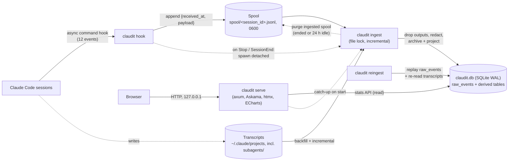

# Architecture

claudit is one Rust binary over one library crate. The library holds all the
logic; `src/main.rs` (the CLI) and `src/web/` (the dashboard) are thin
adapters over it.

## Data flow



1. **Capture.** Claude Code runs `claudit hook` (an `async: true` command
   hook) on `SessionStart`, `SessionEnd`, `UserPromptSubmit`,
   `UserPromptExpansion`, `PreToolUse`, `PostToolUse`, `PostToolUseFailure`,
   `PermissionRequest`, `Notification`, `Stop`, `SubagentStart` and
   `SubagentStop`. The hook stamps the payload with its receive time before
   any I/O, validates `session_id` and reads `hook_event_name`, appends one
   line to `$CLAUDIT_HOME/spool/<session_id>.jsonl` in a single `write`, and
   exits 0. It never touches the database, never writes to stdout and never
   fails visibly: errors and panics go to `logs/claudit.log`. Stdin that is
   not valid JSON is logged and still spooled, as a JSON string of the raw
   text, to `spool/unparsed.jsonl`, so nothing Claude Code sent is lost.
2. **Ingest trigger.** On `Stop` and `SessionEnd` the hook also spawns
   `claudit ingest` fully detached (`src/process.rs`: `setsid` on Unix, a
   new console-less process group on Windows; stdio on the null device;
   never waited on), so nothing heavy runs inside the hook's time budget.
   `claudit serve` runs the same catch-up synchronously before binding.
3. **Ingest** loads the spool and the transcripts into SQLite (see
   [Ingest pipeline](#ingest-pipeline)).
4. **Serve.** `claudit serve` answers every page from the typed stats API
   (`src/stats/`) and renders Askama templates. It never polls: data
   refreshes when the page is reloaded. A session page loads each turn's
   trace (`/sessions/{id}/turns/{prompt_id}`, an HTML fragment) with htmx
   only when the turn is opened. It stops on SIGINT (Ctrl-C) or SIGTERM
   (`claudit kill`; on Windows, `claudit kill` terminates it); with `--detach` it runs as a detached copy of itself
   (see `src/daemon.rs`).

## Module map

| Path | Role |
| --- | --- |
| `src/main.rs` | CLI (clap). `claudit hook` bypasses argument parsing entirely so it can never print or fail. |
| `src/lib.rs` | Library root. |
| `src/paths.rs` | `Paths`: every location claudit touches, from `CLAUDIT_HOME` and `CLAUDE_CONFIG_DIR`. |
| `src/secure_fs.rs` | Owner-only file helpers (dirs `0700`, files `0600` on Unix; Windows relies on the profile folder's ACL), and `open_lock` for lock files. |
| `src/process.rs` | The platform-specific process control: `detach` a child (`setsid` / `DETACHED_PROCESS`), `terminate` and `kill` another process (SIGTERM, SIGKILL / `TerminateProcess`). |
| `src/clock.rs` | `Clock` trait, `SystemClock`, `ManualClock` (tests), µs conversions. |
| `src/logfile.rs` | The error log (`logs/claudit.log`), redacted, one line per error. |
| `src/spool.rs` | `SpoolRecord` and the append-only per-session spool files. |
| `src/hook.rs` | `claudit hook`: `hook::run(paths, clock, spawner, stdin)`; `IngestSpawner` / `DetachedIngest`. |
| `src/daemon.rs` | `claudit serve --detach` and `claudit kill`: the serve lock (`ServeLock`, a file lock on `serve.lock`, the running dashboard's pid and port in `serve.pid`), spawning a detached `claudit serve` (output to `logs/serve.log`) and stopping it (`process::terminate`, then `process::kill`). |
| `src/update.rs` | `claudit update`: finds the latest release from GitHub's `/releases/latest` redirect, downloads its archive with `curl`, checks its SHA-256, unpacks it with `tar` (`.tar.gz`, or `.zip` on Windows), renames the new binary over the running one (on Windows, after moving the running one to `claudit.exe.old`). |
| `src/install.rs` | `claudit install` / `uninstall`: pure `install` / `uninstall` over the settings JSON, wrapped by `install_settings` / `uninstall_settings` (backup, atomic write, state file). |
| `src/db/` | `db::open` (WAL, `synchronous=NORMAL`, 10 s busy timeout, owner-only files) and the migration runner. `build.rs` generates the migration list from `migrations/*.sql`. |
| `src/redact.rs` | `sanitize_hook_payload` (drop outputs, redact) and `redact_str`, over `redaction/patterns.toml`. |
| `src/ingest/mod.rs` | `ingest::run` (one unlocked pass), `ingest::catch_up` (locked, loops until idle, then purges), `ingest::reingest`. |
| `src/ingest/lock.rs` | `IngestLock`: non-blocking file lock (`File::try_lock`) on `ingest.lock`. |
| `src/ingest/offsets.rs` | Byte offsets per file identity (path + inode, the NTFS file index on Windows); `read_complete_lines`. |
| `src/ingest/spool.rs` | Spool files → `raw_events` + projection, one transaction per file. |
| `src/ingest/events/` | `RawEvent`, `archive`, and `project`: one module per hook event, plus shared `tool_call` (every write to `tool_calls`, hooks and transcripts, and the timing precedence), `skill_tool`, `agent_tool`, `subagent_runs`. |
| `src/ingest/transcripts/` | Transcript files → `sessions`, `turns`, `api_messages`, `transcript_entries`, `subagent_runs`, `tool_calls`. `entry.rs` is the tolerant line parser. |
| `src/ingest/purge.rs` | Spool purge. |
| `src/ingest/reingest.rs` | Reset-and-replay, `DERIVED_TABLES`, `KEPT_TABLES`. |
| `src/pricing.rs` | `PriceTable` (from `pricing/prices.toml`), `Usd` (exact picodollars), `Cost`. |
| `src/shell.rs` | The one Bash command-line reader: simple commands, the leading command (`tool_calls.bash_command`), the command key (`pnpm exec vitest`). |
| `src/activities.rs` | `ActivityRules` (from `activities/rules.toml`, plus the user's `activities.toml`): classifies a tool call into an activity and a detail. |
| `src/stats/` | The typed stats API, the dashboard's only data source: `Filter`, `activities`, `consumption`, `cost`, `models`, `prompt` (labels of injected prompts), `sessions`, `session_detail`, `time`, `trace` (a session's turns and each turn's trace), `tools`, `commands` (Bash command keys), `skills`, `subagents`, `ingest_status`. |
| `src/export.rs` | `claudit export` and the session page's downloads: a session as Markdown (`session_markdown`, summary or full) from the stats API, and `resolve_session` (an id or a unique prefix). |
| `src/web/` | axum router bound to `127.0.0.1`, one module per page under `pages/`, embedded assets (`assets.rs`), query-string filters (`filter_params.rs`), display helpers (`format.rs`). |
| `templates/` | Askama templates: `base.html`, `pages/`, `sections/` (one per dashboard section), `partials/`. |
| `assets/` | htmx, ECharts, `claudit.js` (chart renderers), `claudit.css`; compiled into the binary. |
| `migrations/` | SQL migrations, applied in file-name order. |
| `redaction/patterns.toml` | Versioned secret patterns, compiled in. |
| `pricing/prices.toml` | Versioned API price table, compiled in. |
| `activities/rules.toml` | Versioned built-in activity rules, compiled in. |
| `examples/demo_archive.rs` | Builds a demo archive from the test fixtures (screenshots, manual browser checks). |

## Files on disk

`CLAUDIT_HOME` (default `~/.claudit`), all directories `0700` and files `0600`
on Unix:

| Path | Content |
| --- | --- |
| `claudit.db` (+ `-wal`, `-shm`) | The archive. |
| `spool/<session_id>.jsonl` | Hook payloads not yet purged, one `{"received_at": …, "payload": …}` per line. `received_at` is RFC 3339 with nanoseconds; `payload` is the untouched hook JSON. |
| `spool/unparsed.jsonl` | Hook stdin that was not valid JSON, same format with `payload` a JSON string of the raw text. |
| `ingest.lock` | The single-writer ingest lock. |
| `serve.lock` | The dashboard lock: a file lock (`flock`, `LockFileEx` on Windows) held by every running `claudit serve`. Released by the kernel when the process exits, so it never goes stale. |
| `serve.pid` | `<pid> <port>` of the dashboard holding `serve.lock`, once its port is bound; removed on shutdown, and read only while the lock is held. Apart from the lock because a Windows lock also forbids reading the locked file. |
| `ingest.pending` | Present when an ingest found the lock taken since the holder's last round; the holder runs again after releasing the lock. |
| `logs/claudit.log` | `<timestamp> ERROR [<component>] <message>`, redacted. |
| `logs/serve.log` | stdout and stderr of a dashboard started with `claudit serve --detach` (appended). |
| `activities.toml` | Optional user activity rules, read by `claudit serve` on every page (see [Activities](#activities)). |
| `install-state.json` | What install changed, for uninstall (`install::InstallRecord`): the `cleanupPeriodDays` value it replaced and the hook containers (`hooks` object, event arrays) it created. |

Claude Code's side (`CLAUDE_CONFIG_DIR`, default `~/.claude`) is only read,
except `settings.json`, which `install` / `uninstall` rewrite atomically after
writing `settings.json.claudit-backup-<timestamp>`.

## Data model

Timestamps are `INTEGER` microseconds since the Unix epoch (suffix `_us`).
Migrations live in `migrations/NNNN_<name>.sql` and are never edited once
applied. `raw_events` is the only source of truth for hook data; every table
marked *derived* is a projection of `raw_events` and/or the transcripts, and
is rebuilt by `claudit reingest`.

### Bookkeeping (kept by reingest)

**`meta`** (`key` PK, `value`): `schema_version` (latest migration id),
`redaction_patterns_version`, `derivation_version` (the
`ingest::DERIVATION_VERSION` the derived tables were built with, see
[Reingest](#ingest-pipeline)), `transcripts_skipped_lines` (cumulative count
of unknown transcript lines), `transcripts_backfilled_at_us` (when the first
full pass over the transcripts finished).

**`schema_migrations`** (`id` PK, `applied_at_us`): applied migrations.

**`raw_events`**: append-only archive of every sanitized hook payload.

| Column | Meaning |
| --- | --- |
| `id` | `INTEGER PRIMARY KEY`, archive order (the replay order). |
| `session_id`, `hook_event_name` | From the payload; `unparsed` and `claudit:unparsed` for a payload that was not valid JSON (then `payload` is its raw text as a JSON string, archived but never projected). |
| `received_at_us` | When the hook received it. |
| `payload` | The payload JSON, outputs dropped and secrets redacted. |

**`ingest_offsets`** (`path`, `inode`) PK, `byte_offset`, `updated_at_us`:
how far each spool file and transcript has been read.

### Derived from hooks

**`tool_calls`**: one row per tool call, key `tool_use_id`. Filled by
`PreToolUse`, `PostToolUse` / `PostToolUseFailure`, and by the transcripts
(an assistant entry's `tool_use` block, then a user entry's `tool_result`
block), so sessions recorded before `claudit install` have tool calls too.
Each source keeps its own timing (`hook_*`, `transcript_*`); after every
write the effective timing columns are resolved from them
(`events::tool_call::resolve_timing`), a pure function of the stored facts,
so any ingest order and a reingest give the same row:

1. the hooks saw the call complete (`hook_post_at_us`): hook timing;
2. else the transcript has its `tool_result`: transcript timing, with
   `duration_ms` = result − tool_use time (it includes any permission
   prompt, so no report uses it as a duration: reports read the `hook_*`
   columns, see [Time decomposition](#time-decomposition));
3. else the call is still running or was interrupted: only `pre_at_us`,
   and the call is left out of every report until its result arrives (in a
   later ingest, if it is in a later chunk of the transcript).

Identity columns (prompt, agent, input, cwd) are filled by whichever source
comes first; `PostToolUse` overwrites them with its own.

| Column | Meaning |
| --- | --- |
| `tool_use_id` | PK. |
| `session_id`, `prompt_id` | Session and turn. |
| `agent_id` | The subagent that made the call; `NULL` on the main thread. |
| `tool_name` | E.g. `Bash`, `Read`, `mcp__github__create_issue`. |
| `mcp_server` | The server part of an `mcp__<server>__<tool>` name. |
| `bash_command` | Leading command of a Bash call (`shell::leading_command`). |
| `tool_input` | Redacted input JSON. |
| `cwd` | Working directory of the call. |
| `pre_at_us`, `post_at_us` | Effective: `PreToolUse` and `PostToolUse(Failure)` receive times, or the `tool_use` and `tool_result` entry timestamps. |
| `duration_ms` | Effective: execution time as reported by Claude Code (excludes permission prompts), or the transcript estimate `post − pre`. |
| `success` | Effective: 1 for `PostToolUse`, 0 for `PostToolUseFailure`; from a transcript, 0 when the `tool_result` has `is_error: true`. |
| `timing_source` | `hook` or `transcript`: where the effective timing comes from (`transcript` = estimated duration). |
| `hook_pre_at_us`, `hook_post_at_us`, `hook_duration_ms`, `hook_success` | What the hooks recorded. |
| `transcript_pre_at_us`, `transcript_post_at_us`, `transcript_success` | What the transcript recorded (never the result's content). |
| `error` | Error text of a hook-reported failure (redacted). Not taken from transcripts, whose error text is the tool's output. |

**`permission_requests`**: one row per `PermissionRequest`. PK
(`session_id`, `at_us`, `tool_name`); also `prompt_id`, `agent_id`,
`tool_input` (redacted JSON), `cwd`. No dashboard report reads it today (waiting
time comes from `PreToolUse` → execution start); it stays for SQL queries.

**`notifications`**: one row per `Notification`. PK (`session_id`, `at_us`,
`notification_type`); also `prompt_id`, `message`, `cwd`.

**`skill_invocations`**: PK (`session_id`, `invocation_id`).

| Column | Meaning |
| --- | --- |
| `invocation_id` | `expansion:<prompt_id>` for a typed `/skill`, the `tool_use_id` for a Skill tool call. |
| `prompt_id`, `agent_id` | Turn, and subagent (`NULL` on the main thread). |
| `skill` | Skill name. |
| `trigger` | `user` (`UserPromptExpansion`) or `model` (the `Skill` tool). |
| `source` | `command_source` of a user-triggered expansion. |
| `args` | Arguments (redacted). |
| `at_us` | Receive time. |

### Derived from transcripts (and hooks)

**`sessions`**: one row per session, key `session_id`. `cwd` (first seen),
`git_branch` and `version` (Claude Code, latest entry), `first_at_us` /
`last_at_us` (transcript span), `source` (`startup`/`resume`/`clear`/`compact`,
from `SessionStart`), `ended_at_us` / `end_reason` (from `SessionEnd`).

**`turns`**: one row per user prompt, key (`session_id`, `prompt_id`), the
key both hooks and transcripts carry, so they meet in one row whichever is
ingested first.

| Column | Source |
| --- | --- |
| `prompt_text` | First prompt text of the turn (redacted): the first non-meta user entry, or a meta entry Claude Code injected to open the turn (`promptSource: "system"`, e.g. a subagent's `<agent-message>` hand-back); `UserPromptSubmit`'s `prompt` otherwise. |
| `permission_mode`, `effort` | Transcript. |
| `start_at_us`, `end_at_us` | Earliest and latest main-thread transcript entry. |
| `submit_at_us`, `stop_at_us` | `UserPromptSubmit` and `Stop` receive times. |

Time reports use `submit_at_us` and `stop_at_us` only (a turn without both
is not timed); ordering and date filters of consumption reports use
`COALESCE(submit_at_us, start_at_us)`, so imported turns are still counted.

**`api_messages`**: one row per API response, key `message_id`
(`message.id`). `session_id`, `prompt_id`, `agent_id` (`NULL` on the main
thread), `agent_type` (`attributionAgent`), `model`, `at_us` (first entry),
`input_tokens`, `output_tokens`, `cache_write_tokens` (both TTLs),
`cache_write_1h_tokens` (the 1-hour part), `cache_read_tokens`, `skill`
(`attributionSkill`). A response streamed over several entries repeats its
usage with growing output, so token columns are upserted with `MAX`. Messages
with model `<synthetic>` (made up locally by Claude Code) are skipped.

**`transcript_entries`** (`uuid` PK, `session_id`, `prompt_id`): every entry
already ingested, for deduplication (resumed sessions repeat earlier entries
in a new file) and so entries without a `promptId` inherit their parent's.

**`subagent_runs`**: one row per subagent run, key `agent_id` (the bare id,
as in `subagents/agent-<id>.jsonl`). `session_id`, `prompt_id` (parent turn),
`agent_type`, `parent_tool_use_id` (the Agent/Task call), `model`
(`resolvedModel`), `started_at_us` (earliest known), `stopped_at_us` (latest
known), `total_duration_ms` (`totalDurationMs`), `total_tool_use_count`
(`totalToolUseCount`). Merged order-independently from `SubagentStart`,
`SubagentStop`, the parent's Agent tool response, and the subagent's
transcript and `.meta.json`: first non-empty value wins, earliest start,
latest stop.

**`subagent_events`**: one row per `SubagentStart` / `SubagentStop`, key
(`agent_id`, `at_us`, `event`); also `session_id`, `prompt_id`. A run can
stop and be resumed (a `SendMessage` to a background agent), so the events
are kept rather than merged: reports pair each start with the next stop
(see [Subagent runs](#subagent-runs)).

## Ingest pipeline

`claudit ingest` (and the catch-up `serve` runs) is `ingest::catch_up`:

1. **Lock.** Take a non-blocking file lock on `$CLAUDIT_HOME/ingest.lock`. If
   another ingest holds it, touch `ingest.pending` and exit at once: that
   run will pick up whatever is pending. The kernel releases the lock when
   the holder exits or crashes, so it never goes stale.
2. **Passes.** Run passes (spool, then transcripts) until one finds no new
   input (at most 100), so input that arrived while another run was locked
   out is never left behind.
3. **Spool.** For each spool file, in one `IMMEDIATE` transaction: read the
   complete lines after its offset, parse each line into a `RawEvent`
   (dropping outputs and redacting, see below), append it to `raw_events`,
   project it into the derived tables, and store the new offset. Unparsable
   lines are skipped, counted and logged; payloads missing what their event
   needs, and payloads the hook spooled raw because they were not valid
   JSON, are archived (redacted) but counted as unprojected.
4. **Transcripts.** Every `<project>/<session_id>.jsonl` and
   `<project>/<session_id>/subagents/agent-<id>.jsonl` under
   `$CLAUDE_CONFIG_DIR/projects` is read the same way (offset per file, one
   transaction per file). Only `user`, `assistant`, `system` and `attachment`
   entries are used; about twenty other line types are ignored, and lines of
   unknown shape are skipped, counted (in `meta`) and logged. The first pass
   is the backfill.
5. **Purge.** A spool file is deleted once its offset has reached its end
   and either its session's latest archived event is `SessionEnd`, or it has
   been idle for 24 hours (crashed sessions never send `SessionEnd`). Its
   offsets are forgotten so a resumed session starts a fresh file.
6. **Release, then re-check.** Release the lock, then consume
   `ingest.pending`: if it was there, a run was turned away after this
   run's last pass had already looked at the inputs, so take the lock again
   and go back to step 2 (the marker is also cleared when a round starts,
   since that round's passes cover it).

**Offsets.** Progress is a byte offset keyed by file identity (path +
inode): a file replaced at the same path is read from the start, and a file
shorter than its offset (truncated) too. Only complete lines are consumed; a
trailing partial line (a line Claude Code or the hook is still writing) stays
for the next run.

**Deduplication keys.** Every projection is an idempotent upsert on a natural
key, so replaying an event or re-reading a transcript never double-counts:

| Table | Key |
| --- | --- |
| `tool_calls` | `tool_use_id` |
| `turns` | `session_id` + `prompt_id` |
| `sessions` | `session_id` |
| `api_messages` | `message_id` (tokens merged with `MAX`) |
| `transcript_entries` | `uuid` |
| `skill_invocations` | `session_id` + `invocation_id` |
| `subagent_runs` | `agent_id` |
| `subagent_events` | `agent_id` + `at_us` + `event` |
| `permission_requests` | `session_id` + `at_us` + `tool_name` |
| `notifications` | `session_id` + `at_us` + `notification_type` |

`raw_events` itself is append-only; spool offsets guarantee each spool line
is archived once.

**Redaction and dropped outputs** (`src/redact.rs`). Before a hook payload is
archived or projected, `sanitize_hook_payload`:

- removes `last_assistant_message` (the assistant's response text);
- reduces `tool_response` to `TOOL_RESPONSE_ALLOWLIST` (`agentId`,
  `agentType`, `status`, `resolvedModel`, `totalDurationMs`, `totalTokens`,
  `totalToolUseCount`, and `usage` with only its numeric members), and drops
  it entirely when it is a bare string or array; the same applies inside a
  batched payload's `tool_calls`;
- redacts every string with the patterns of `redaction/patterns.toml`, and
  replaces whole any string member whose name matches
  `secret|key|token|password|passwd`.

Transcript text (prompts, and each session's working directory and git
branch) goes through `redact_str`, and tool inputs through `redact_value`,
as soon as they are extracted; assistant text and tool results are never
extracted (of a `tool_result`, only its `tool_use_id` and `is_error`). The error
log is redacted too. Sanitizing is idempotent, so it is safe to re-apply.

**Reingest** (`claudit reingest`, `src/ingest/reingest.rs`) waits up to 60 s
for the ingest lock, then, in one transaction:

1. re-sanitizes every `raw_events` payload with the current patterns and
   stores the result (a pattern added later applies retroactively);
2. deletes every row of `DERIVED_TABLES` (`permission_requests`,
   `notifications`, `skill_invocations`, `subagent_events`, `subagent_runs`, `tool_calls`,
   `sessions`, `turns`, `api_messages`, `transcript_entries`; children before
   parents), the derived `meta` keys, and the transcript offsets (spool
   offsets are kept, so archived spool lines are not archived twice);
3. replays `raw_events` in `id` order through the same `events::project`.

It then runs a normal ingest pass, which re-reads every transcript still on
disk from the start.

**One-time rebuild after an upgrade.** Transcripts read to their end are
never read again, so a release that derives more from them (tool calls from
transcripts, `DERIVATION_VERSION` 1) would never see the old ones. The
catch-up (`claudit ingest`, `serve`'s start) therefore compares the
`derivation_version` in `meta` with `ingest::DERIVATION_VERSION` under the
lock: if it is older or missing and the archive is not empty, it runs the
reset-and-replay above before its passes (version 2 added `subagent_events`
and the text of injected meta prompts; version 3 changed the leading
command of Bash calls) (logged as `INFO` in
`logs/claudit.log`, reported as `IngestReport::rebuilt`), then stores the
current version, so it happens once. A new archive just stores the version.
`claudit reingest` stores it too. Bump the constant whenever ingest derives
more from input it has already read. `KEPT_TABLES` (`meta`, `schema_migrations`,
`raw_events`, `ingest_offsets`) are left alone. A unit test fails when a table
exists in neither list.

Because transcripts deleted by Claude Code's retention cannot be re-read,
token counts of sessions whose transcripts are gone are lost by a reingest.
`claudit install` raises `cleanupPeriodDays` to 365 to keep that window wide.

## Time decomposition

Defined in `src/stats/time.rs`. **Time is measured only from hook-recorded
data.** A session with no hook data at all is **imported** (known only from
its transcripts: it ran before `claudit install`); it counts for
consumption (sessions, turns, tokens, cost, models, skills, subagents' tokens,
tool calls, failures, activity call counts) but never for time, because a
transcript's timestamps include permission prompts, idle time and background
tasks. `stats::time::time_coverage` reports how many filtered sessions were
recorded with hooks and how many are imported, for the dashboard's coverage
notes. For each **main-thread turn** with both a `UserPromptSubmit` and a
`Stop` hook:

- **start** = `UserPromptSubmit` receive time; **end** = `Stop` receive
  time; **wall** = end − start. A turn missing either hook (an imported
  session, a hook Claude Code failed to run, an interrupted turn) is not
  timed; there is no transcript fallback.
- The turn's main-thread tool calls the hooks timed (`agent_id IS NULL`,
  with a `hook_post_at_us`) give intervals:
  - **execution** = `[post − duration_ms, post]` (or `[pre, post]` when no
    duration is known);
  - **waiting** = `[pre, execution start]` when positive: the call was
    announced (`PreToolUse`) but had not started, i.e. a permission prompt;
  - a call known only from its transcript gives no interval (it would
    carry its permission prompt as tool time). Each call is one row
    whichever sources saw it, so it counts once, with the hook timing.
- A call during which the main thread is **blocked on a subagent** gives a
  **subagent** interval: an `Agent` / `Task` call (a foreground run lasts
  as long as the call), or a blocking `TaskOutput` (`block` not false)
  whose `task_id` is a subagent run of the session. Every other call's
  execution is a **tool** interval, including waits that cannot be told
  apart reliably (a `sleep` loop, `Monitor`): the turn trace shows what
  they were. Calls made *inside* a subagent carry an `agent_id` and are
  never main-thread time.
- A **background** subagent (the Agent call returns in milliseconds with
  `status: "async_launched"`) is not main-thread time: it runs alongside
  whatever the main thread does (often after the turn has ended), so only
  its Agent call's own milliseconds count. Its real duration is its run
  time (below), and the trace draws it as its own lane.
- Every interval is clipped to `[start, end]`. The turn is cut at every
  interval boundary, and each elementary slice is assigned to the
  highest-priority kind covering it: **subagent > tool > waiting > model**.
  Anything uncovered is **model** time (the model generating, plus
  unexplained overhead).

Consequences: parallel calls overlap instead of adding up; tool time never
exceeds wall time; waiting excludes any instant where something was
executing; and `model + tool + waiting + subagent = wall` exactly, per turn
and in every aggregate.

**A deliberate refinement of the spec.** The spec splits a turn into three
parts (model = wall − tool − waiting, clamped at 0) and reports subagent
time separately, from `subagent_runs`. claudit adds **subagent** as a fourth
component of the same partition instead: the execution intervals of the
turn's main-thread `Agent` / `Task` calls, with priority subagent > tool >
waiting > model. Otherwise a turn that delegates would count the whole
subagent run as tool time (the Agent call is a tool call) and the clamp
would hide any overlap; with four prioritized kinds the components
partition wall time exactly, with no clamping. Per-run subagent durations
and tokens are still reported separately (`stats::subagents`). `TurnTime.segments` exposes the same partition as
positioned, gap-free segments, which the session timeline draws.

Aggregates (`time_breakdown`) sum turns, and assign each turn to the UTC day
it started. The same hook-only rule applies everywhere time appears: tool
durations and percentiles (`stats::tools`, `CallStats::timed_calls` of
`calls`), activity time (`stats::activities`), skills' attributed time (the
turn's hook window), Bash command durations (`stats::commands`), and
subagent durations (see [Subagent runs](#subagent-runs)).

### Subagent runs

A run's duration (`stats::subagents`) is its **active time**: each
`SubagentStart` paired with the next `SubagentStop` (receive times), the
spans summed. A stop with no start before it (hooks installed while it ran)
or a start with no stop (still running, interrupted) gives no span. Without
any span, Claude Code's `totalDurationMs` from the Agent tool response
(foreground runs); else no duration. Never the Agent call's hook duration
(a background launch returns in milliseconds) nor a transcript span.

### Turns and traces

`stats::trace::session_turns` lists **every** turn of a session, oldest
first, timed or not: its start (`UserPromptSubmit`, else its first
transcript entry, an instant), its labelled prompt, its duration (hook-timed
only, else none), completed calls and failures (subagents' included),
subagent runs launched, test runs (calls of the built-in `Tests` activity)
and their failures, tokens and cost (`cost::session_cost_by_turn`).

`stats::trace::turn_trace` is one turn's trace:

- **lanes**: the main thread (span: submit → stop), then every subagent run
  launched in the turn or making calls in it (spans: all its active spans,
  so a background run outliving the turn is shown whole), then runs of
  other turns active during it (spans clipped to the trace);
- **calls**: every `tool_calls` row of the turn (subagents' included), by
  launch instant (`PreToolUse`, else the transcript's `tool_use` entry).
  A hook-timed call has an execution `[post − duration_ms, post]` and a
  permission wait `PreToolUse` → execution start; a call only a transcript
  saw has only its launch instant (drawn as a tick). Each carries its
  activity, status, hook error and a **summary** of its stored (redacted)
  input: the Bash command, the file path, the Grep/Glob pattern and path,
  the URL or query, `server · tool` for MCP, the skill and its arguments,
  `subagent_type · description` for Agent, the task id; never an output.
- the trace spans the turn and everything in it, so a lane can end long
  after `Stop`.

### Injected prompts

Claude Code opens some turns itself. `stats::prompt::label` turns their
markup into a label: `<task-notification>` → `Task notification: <summary>`,
`<agent-message from="…">` → `Message from subagent: <description of its
Agent call>`, `<command-name>` / `<command-args>` → `/name args`,
`<bash-input>` → `! command`, `<local-command-…>` / `<bash-std…>` →
`Local command output`, `<scheduled-task name=…>` → `Scheduled task: name`.
A session's first prompt (session list, session page) is its first typed
prompt, a slash command included, and only failing that its first prompt of
any kind (`prompt::INJECTED_SQL`).

## Cost computation

`pricing/prices.toml` lists, per model id (plus aliases), USD per million
tokens for `input`, `output`, `cache_write_5m`, `cache_write_1h` and
`cache_read`, with a `version` (the date prices were read) and a `source`.
It is compiled in (`PriceTable::builtin`).

Nothing priced is stored. Each `stats::cost` report sums `api_messages`
tokens per model in SQL, then prices them:

```
cost = input × p_input + output × p_output
     + (cache_write − cache_write_1h) × p_cache_write_5m
     + cache_write_1h × p_cache_write_1h
     + cache_read × p_cache_read
```

Amounts are exact integers (`Usd` counts picodollars; `$p/MTok` is `p` µ$
per token, so any price with up to 6 decimals multiplies without rounding).
Model lookup strips a `[1m]`-style context suffix, a snapshot date
(`-20251001` / `@20251001`) and a provider prefix (`us.anthropic.`), then
matches exactly: a model missing from the table is reported as unknown
(`Cost.unknown_models`, `unknown_tokens`) rather than priced as its family.
Because cost is computed at query time, correcting the table and rebuilding
reprices the whole archive without re-ingesting.

`stats::models::model_usage` prices the same sums per model and thread
(main thread vs subagents), and reports each model's share of the filtered
tokens and of the *priced* cost (a model the table lacks has no cost share,
and the others' shares are then shares of the known part).

## Activities

`src/activities.rs` classifies a tool call (tool name, MCP server, the
`bash_command` column and `tool_input.command`) with an ordered list of
rules: the user's `$CLAUDIT_HOME/activities.toml` first, then the built-in
`activities/rules.toml`. The first rule whose tool glob, optional leading
command glob and optional regex (searched in each simple command of the
line, see docs/GUIDE.md) all match gives the activity; otherwise it is
`Other shell` (Bash) or `Other`. Each call also gets a **detail**: for Bash
its command key (below), for MCP the server, otherwise the tool name.

### Bash command lines

`src/shell.rs` is the only reader of command lines. It splits a line into
simple commands (at `&&`, `||`, `;`, `|`, `&`, newlines and parentheses
outside quotes; here-documents and comments skipped), strips assignments,
shell keywords and wrappers (`sudo`, `env`, `timeout N`, …), and derives:

- the **leading command** (stored in `tool_calls.bash_command`, matched by
  rules' `commands`): the first simple command that is not a setup command
  (`cd`, `export`, `set`, `source`, `echo`, `printf`, `sleep`, `true`, `[`,
  …), else its `sleep`, else its first; `until` / `while` for a line that
  opens with such a loop (the built-in *Waiting & polling* rule matches
  `until`, `while` and `sleep`, before every other rule);
- the **command key** of a simple command: the program, plus for known
  multi-command programs its subcommand (options and the values of common
  valued options skipped), a package manager runner's target
  (`pnpm exec vitest`, `uv run pytest`) or a group's subcommand
  (`docker compose up`); `python -m <module>`; `until <program>` for a loop
  condition. Kept words start with a letter and contain no `/`, `.`, `=`,
  quote, `$` or bracket, so paths, files and arguments never appear.

A Bash call's key is that of its **most significant** simple command: the
one the first matching activity rule's pattern matched (rules run tests,
lint, build, git, … in order, so `cargo build && cargo test` is
`cargo test`), else the leading one. `stats::commands` ranks calls by key
(runs and failures of every call; total, median and p95 of the hook-timed
ones; share of hook-timed Bash time), filtered or for one session, in any of
five orders (`CommandSort`). `CommandRanking::hide_activity` removes one
activity's commands and reports what it removed: the dashboard hides
*Waiting & polling* from its "slowest" views unless asked.

`ActivityRules::with_classification_cache` gives the rules a cache shared
by their clones: each distinct call (tool, server, leading command, command
line) is classified once. `web::frame` makes one per page, so the
activities, commands and trace reports of a page share their work, and
nothing is cached across pages.

Like cost, nothing classified is stored: `stats::activities` reads the
filtered `tool_calls` rows and classifies them in Rust, classifying each
distinct call once per report (about 30–70 ms for 50 000 calls in a release
build), so a rule change applies to the whole archive without a reingest.
The dashboard loads the rules on every page (`web::frame`), keeping the last
compiled user file while its text is unchanged; an invalid file is logged
once per distinct problem, ignored, and reported in a banner.

## The stats API

Every report is `fn(&Connection, &Filter, …) -> Result<Report>` returning
plain structs (`src/stats/`). `Filter` holds `from` (inclusive), `to`
(exclusive), `project` (a working directory and everything below it),
`branch` and `model`; each report declares, through `FilterColumns`, which
SQL expression implements each dimension, and filtering on a dimension a
report cannot honour is an error rather than silently ignored. HTTP handlers
only parse filters, call reports and render templates; there is no SQL in
`src/web/`.

## Test seams

Tests exercise external behavior through two seams only (see
[CONTRIBUTING.md](CONTRIBUTING.md)):

1. **The core library, end to end.** `tests/common/mod.rs` builds a
   `TestEnv`: a temp `CLAUDIT_HOME`, a temp Claude config dir and a
   `ManualClock`. Hook fixtures go in through `claudit::hook::run` (the same
   entry point as `claudit hook`, with a recording spawner instead of a real
   detached process), transcript fixtures are dropped into the projects dir,
   ingest runs, and assertions are made on the typed `claudit::stats`
   reports. The `claudit hook` process contract (exit 0, no stdout, errors
   logged) and `claudit reingest` are also exercised through the built binary.
2. **The settings transformation.** `claudit::install::{install, uninstall}`
   are pure functions over the settings JSON: idempotent install, foreign
   hooks preserved, `cleanupPeriodDays` raised and restored, and an
   install → uninstall round trip returning the original, empty hook
   containers the user wrote included (`tests/settings.rs`).

There are no tests on the HTTP layer or templates: they are thin adapters
over the stats API. The one exception is `tests/web_pages.rs`, a render smoke
check (every page, and a turn trace fragment, answers 200 and contains its
section ids; no assertion on content), because issues #11 and #12 require
each page to render.
