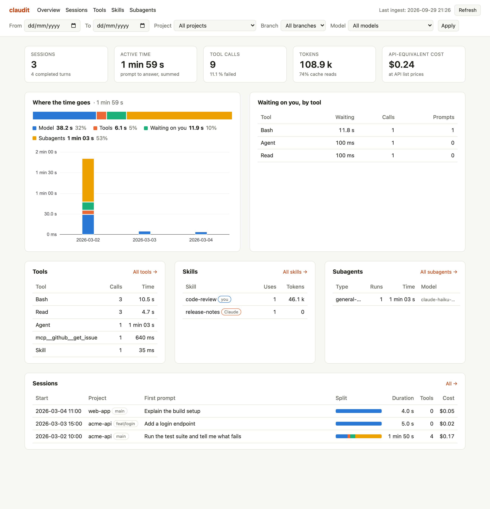
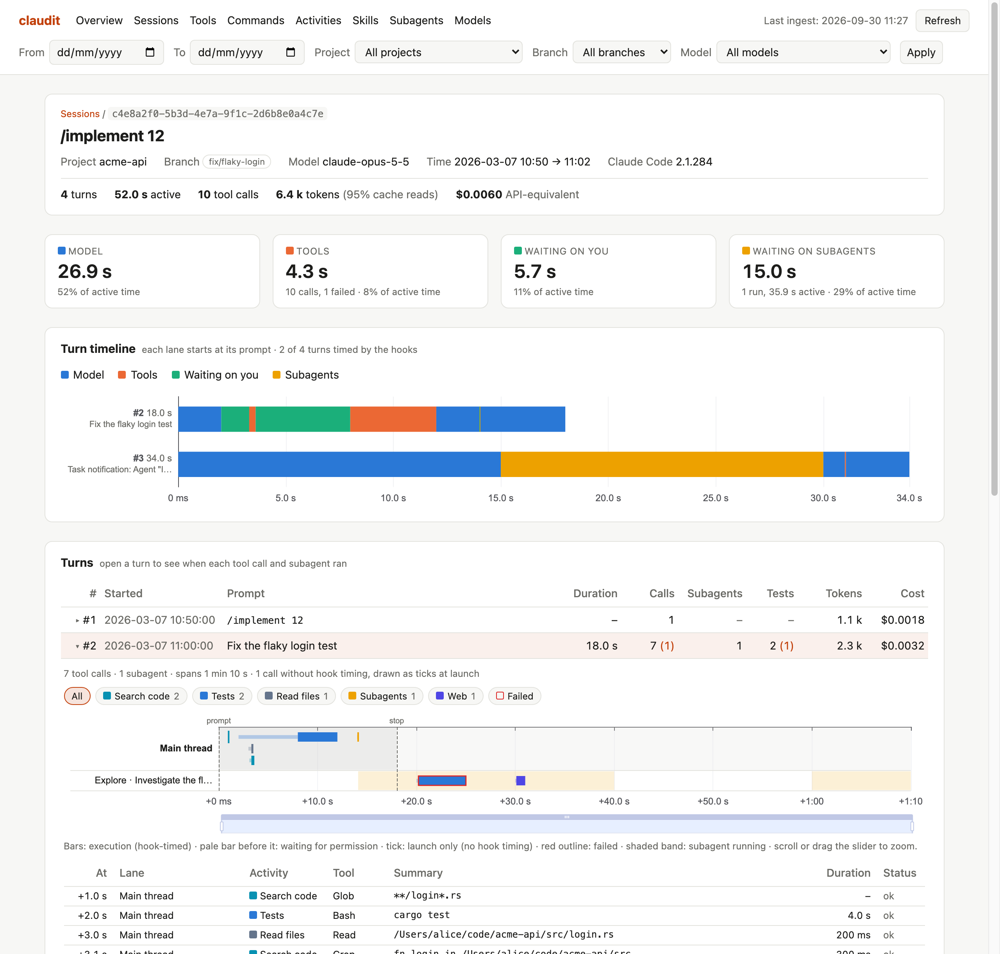

# claudit

Local analytics for [Claude Code](https://code.claude.com) sessions.

claudit records every Claude Code session on your machine into a permanent
SQLite archive and serves a local dashboard to analyze them after the fact:

- **where the time goes** in each turn: the model working, tools running,
  Claude waiting on you (permission prompts), subagents;
- **tools**: call counts, median and p95 durations, failure rates, broken
  down by Bash command (`git`, `cargo`, …) and by MCP server;
- **skills**, split by who triggered them (you typing `/skill`, or Claude
  calling the Skill tool), with their attributed time and tokens;
- **subagents** by type, with duration, tool calls, model and tokens;
- **tokens** (input, output, cache write, cache read) and an
  **API-equivalent cost** per session, model, skill and day;
- **models**: sessions, API responses, tokens, cache-read share and cost per
  model, with its share of all tokens and cost, split between the main
  thread and subagents.

It runs entirely on your machine: no account, no telemetry, no network.





## How it works

Claude Code runs `claudit hook` as an
[async command hook](https://code.claude.com/docs/en/hooks) on twelve
events. The hook appends the raw payload, stamped with its receive time, to a
per-session spool file and exits; it never blocks your session, never prints
anything and never fails visibly. At the end of every turn it starts
`claudit ingest` in the background, which loads the spool and Claude Code's
transcripts (`~/.claude/projects`, including subagent transcripts) into
`~/.claudit/claudit.db`. The first ingest backfills every transcript still on
disk, so your history starts with whatever Claude Code has kept (30 days by
default) rather than from zero. From then on the archive keeps everything,
independently of Claude Code's own retention.

There is no daemon. `claudit serve` starts the dashboard when you want it,
catches up on pending ingestion first, and stops on Ctrl-C.

See [ARCHITECTURE.md](ARCHITECTURE.md) for the full data flow and data model.

## What is captured, and what never is

**Stored** (after redaction, see below):

- hook payloads for `SessionStart`, `SessionEnd`, `UserPromptSubmit`,
  `UserPromptExpansion`, `PreToolUse`, `PostToolUse`, `PostToolUseFailure`,
  `PermissionRequest`, `Notification`, `Stop`, `SubagentStart` and
  `SubagentStop`, with their receive timestamps;
- your prompts (the text you type);
- tool **inputs** (the command Claude ran, the file it read, the pattern it
  searched for, …) and tool error messages;
- from transcripts: session metadata (working directory, git branch, Claude
  Code version), turn timings, permission mode and effort, and for each API
  response the model, timestamp, token counts and the skill or subagent it is
  attributed to.

**Never stored:**

- **tool outputs**: a hook's `tool_response` is dropped at ingest, except a
  fixed allow-list of summary fields the Agent tool reports about a subagent
  run (`agentId`, `agentType`, `status`, `resolvedModel`, `totalDurationMs`,
  `totalTokens`, `totalToolUseCount`, and the numeric members of `usage`).
  Only numbers, flags and identifiers are allowed there, never free text;
- **assistant responses**: the text Claude writes back
  (`last_assistant_message` on `Stop`/`SubagentStop`, and assistant message
  content in transcripts) is never read into the archive;
- tool results inside transcripts.

The raw spool file holds the untouched payload only until it has been
ingested; it is deleted once its session has ended (or after 24 hours of
inactivity for sessions that never ended cleanly).

## Privacy

- **Secret redaction before anything is stored.** Every string of every hook
  payload, and every text taken from transcripts, goes through a versioned
  list of patterns ([`redaction/patterns.toml`](redaction/patterns.toml)):
  `sk-…` API keys, GitHub tokens (`ghp_…`, `gho_…`, `github_pat_…`, …), AWS
  access key ids (`AKIA…`, `ASIA…`), `Bearer …` tokens, JSON members and
  `NAME=value` assignments whose name contains `secret`, `key`, `token` or
  `password`. Matches become `[REDACTED]`. When the list grows,
  `claudit reingest` re-applies it to the whole archive, raw events included.
  Redaction is pattern based: it catches common secret shapes, not every
  possible one.
- **Owner-only files.** Everything under `~/.claudit` is created with mode
  `0600` (files) and `0700` (directories), including the SQLite WAL files and
  the settings backups `claudit install` writes.
- **Localhost only.** `claudit serve` binds to `127.0.0.1`; there is no option
  to listen on another interface.
- **No network.** claudit makes no outgoing connections. The dashboard's
  JavaScript (htmx, ECharts) and CSS are embedded in the binary; nothing is
  loaded from a CDN.
- There is no encryption at rest: the archive is as private as your user
  account.

## Quick install

macOS (Apple silicon or Intel):

```sh
VERSION=v0.1.0
TARGET="$([ "$(uname -m)" = arm64 ] && echo aarch64 || echo x86_64)-apple-darwin"
mkdir -p ~/.local/bin
curl -fsSL "https://github.com/TristanShz/claudit/releases/download/$VERSION/claudit-$VERSION-$TARGET.tar.gz" \
  | tar -xz --strip-components=1 -C ~/.local/bin "claudit-$VERSION-$TARGET/claudit"

claudit install   # add claudit's hooks to ~/.claude/settings.json (a backup is written first)
claudit serve     # open http://127.0.0.1:8421
```

Make sure `~/.local/bin` is on your `PATH`. With Rust installed,
`cargo install --locked --git https://github.com/TristanShz/claudit` works too.

New Claude Code sessions are recorded from then on, and the first ingest
imports the transcripts already on disk. `claudit install` also raises
`cleanupPeriodDays` to 365 so transcripts are kept long enough; run it again
if you move the binary. `claudit uninstall` removes exactly what install
added and keeps your archive in `~/.claudit`.

## Commands

| Command | What it does |
| --- | --- |
| `claudit install` | Adds claudit's hooks to Claude Code's user settings (see above). |
| `claudit uninstall` | Removes them and restores `cleanupPeriodDays`. |
| `claudit serve [--port N]` | Catches up on pending ingestion, then serves the dashboard on `127.0.0.1:N` (default 8421) until Ctrl-C. |
| `claudit ingest` | Loads new spooled events and transcripts into the archive. Runs automatically after each turn; safe to run by hand at any time (it is incremental, deduplicated and exits at once if another ingest is running). |
| `claudit reingest` | Rebuilds every derived table from the archived hook events plus the transcripts still on disk, re-applying the current redaction patterns. Use it after an upgrade that changes the schema, the parser or the patterns. |
| `claudit hook` | Records one hook payload from stdin. Run by Claude Code, not by hand. |

### Environment variables

| Variable | Default | Meaning |
| --- | --- | --- |
| `CLAUDIT_HOME` | `~/.claudit` | Where claudit keeps its data: `claudit.db`, `spool/`, `logs/claudit.log`, `install-state.json`, `ingest.lock`, `ingest.pending`. |
| `CLAUDE_CONFIG_DIR` | `~/.claude` | Claude Code's configuration directory: `settings.json` and the `projects/` transcripts. Set it the same way you set it for Claude Code. |

Hooks inherit Claude Code's environment, so a `CLAUDIT_HOME` set in the
shell you start Claude Code from also applies to recording.

### When something looks wrong

Everything that fails inside the hook or a background ingest is appended to
`~/.claudit/logs/claudit.log` (redacted, one line per error). A hook payload
that is not valid JSON is logged and archived as raw text (redacted) instead
of being dropped. Transcript lines of an unknown shape are skipped, counted
and logged; the dashboard shows a banner when there are any.

## Querying the archive with SQL

The archive is a plain SQLite database, and direct SQL is the supported way
to answer questions the dashboard doesn't:

```sh
sqlite3 ~/.claudit/claudit.db
```

Stick to `SELECT`: claudit owns the data, and `claudit reingest` rebuilds the
derived tables anyway. The database is in WAL mode, so reading it never
blocks a running ingest.

Timestamps are integers in microseconds since the Unix epoch (columns ending
in `_us`); `datetime(x / 1000000, 'unixepoch')` makes them readable. The
tables are described in [ARCHITECTURE.md](ARCHITECTURE.md#data-model).

```sql
-- Most used tools, with failures and total execution time.
SELECT tool_name, COUNT(*) AS calls,
       SUM(success = 0) AS failures,
       ROUND(SUM(duration_ms) / 1000.0, 1) AS total_s
FROM tool_calls
GROUP BY tool_name ORDER BY calls DESC LIMIT 15;

-- What Claude runs in your shell, by leading command.
SELECT bash_command, COUNT(*) AS calls, SUM(success = 0) AS failures
FROM tool_calls WHERE tool_name = 'Bash'
GROUP BY bash_command ORDER BY calls DESC LIMIT 15;

-- Tokens per day and model.
SELECT date(at_us / 1000000, 'unixepoch') AS day, model,
       SUM(input_tokens) AS input, SUM(output_tokens) AS output,
       SUM(cache_write_tokens) AS cache_write, SUM(cache_read_tokens) AS cache_read
FROM api_messages
GROUP BY day, model ORDER BY day DESC, output DESC;

-- Sessions per project and branch.
SELECT cwd, git_branch, COUNT(*) AS sessions,
       datetime(MAX(last_at_us) / 1000000, 'unixepoch') AS last_active
FROM sessions
GROUP BY cwd, git_branch ORDER BY sessions DESC;

-- Skills, by who triggered them.
SELECT skill, trigger, COUNT(*) AS invocations
FROM skill_invocations
GROUP BY skill, trigger ORDER BY invocations DESC;

-- Your last ten prompts.
SELECT datetime(COALESCE(submit_at_us, start_at_us) / 1000000, 'unixepoch') AS at,
       substr(prompt_text, 1, 80) AS prompt
FROM turns ORDER BY COALESCE(submit_at_us, start_at_us) DESC LIMIT 10;
```

Costs are not stored: they are computed at query time from token counts and
the compiled-in price table ([`pricing/prices.toml`](pricing/prices.toml)).

The schema may change between releases (new migrations are applied
automatically when claudit opens the database). `raw_events` keeps every
redacted hook payload as JSON, so it is the most stable thing to query.

## Limitations

- **The cost is an estimate.** It is what the recorded tokens would cost at
  Anthropic's public API list prices (standard rates: no batch discount, no
  data-residency or partner-platform pricing), as of the price table's date.
  It is not what you pay on a subscription plan, and models missing from the
  table are reported as unpriced rather than guessed.
- **The transcript format is undocumented** and can change with any Claude
  Code release. Parsing is tolerant: lines of an unknown shape are skipped and
  counted rather than failing the ingest, and the raw hook events are kept so
  `claudit reingest` can recover fields a newer parser understands.
- **Only sessions with the hooks installed have full timing.** Backfilled
  sessions (from before `claudit install`) have tokens, turns and costs from
  their transcripts, but no tool calls, permission waits or skill triggers,
  which come from hooks.
- **Time is measured from hook receive times**, so it includes the small
  delay Claude Code takes to start each hook process.
- Redaction is pattern based and cannot recognize every secret. Prompts and
  tool inputs are stored; don't use claudit if that is unacceptable for your
  work.
- macOS is the only release target. Windows is not supported.

## Contributing

See [CONTRIBUTING.md](CONTRIBUTING.md). Changes are listed in
[CHANGELOG.md](CHANGELOG.md).

## License

Licensed under either of [Apache License, Version 2.0](LICENSE-APACHE) or
[MIT license](LICENSE-MIT) at your option.

Unless you explicitly state otherwise, any contribution intentionally
submitted for inclusion in the work by you, as defined in the Apache-2.0
license, shall be dual licensed as above, without any additional terms or
conditions.
